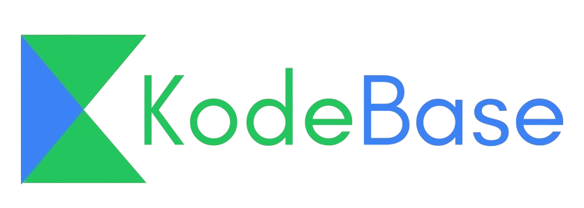

# 🚀 Multi-Code IDE



A powerful, web-based code editor that supports multiple programming languages, allowing users to write, save, and execute code in the browser.

[](https://soide.netlify.app)

## ✨ Features

- 🖥️ **Monaco Editor Integration**: Feature-rich code editor with syntax highlighting, code completion, and more
- 🔄 **Multi-language Support**: Code in JavaScript, Python, C, C++, Java, Go, and Bash
- 🔒 **User Authentication**: Secure sign-up and login system 
- 💾 **Project Management**: Create, edit, save, and organize your coding projects
- ⚡ **Code Execution**: Run your code directly in the browser and view the output
- 🎨 **Dark/Light Mode**: Switch between themes for comfortable coding in any environment
- 📱 **Responsive Design**: Optimized for both desktop and mobile devices

## 🛠️ Technology Stack

### Frontend
- **React** - UI framework
- **Vite** - Build tool
- **Monaco Editor** - Code editor component
- **React Router** - Navigation
- **Tailwind CSS** - Styling
- **Framer Motion** - Animations

### Backend
- **Express.js** - Web server framework
- **MongoDB** - Database
- **JWT** - Authentication
- **bcryptjs** - Password hashing

### Code Execution
- **Piston API** - Code execution engine

## 🏃‍♂️ Live Demo

Visit the application at: [https://soide.netlify.app](https://soide.netlify.app)


## 🚀 Getting Started

### Prerequisites

- Node.js (v14+)
- npm or yarn
- MongoDB

### Installation

#### Clone the repository
```bash
git clone https://github.com/SHOEB091/code-IDE.git
cd code-IDE
```

#### Backend Setup
```bash
cd backend
npm install

# Create a .env file in the backend directory with:
# MONGO_URI=your_mongodb_connection_string
# JWT_SECRET=your_jwt_secret_key

npm start
```

#### Frontend Setup
```bash
cd frontend
npm install

# Create a .env file in the frontend directory with:
# VITE_API_URL=http://localhost:3000 (for development)
# VITE_API_URL=https://multi-code-ide-backend-agqv.onrender.com (for production)

npm run dev
```

## 🧪 Available Scripts

### Backend
- `npm start`: Starts the server
- `npm run dev`: Starts the server with nodemon for development

### Frontend
- `npm run dev`: Starts the development server
- `npm run build`: Builds the app for production
- `npm run preview`: Locally preview the production build

## 🔄 Workflow

1. **User Registration/Login**: Create an account or sign in to access your projects
2. **Project Management**: Create a new project and select a programming language
3. **Code Editing**: Write your code in the Monaco Editor
4. **Save & Execute**: Save your project and run the code to see the output
5. **Iteration**: Modify your code, save changes, and run again as needed

## 📁 Project Structure

```
multi-code-ide/
├── backend/            # Express.js backend
│   ├── app.js          # Express application setup
│   ├── bin/            # Server startup scripts
│   ├── config/         # Database configuration
│   ├── controllers/    # Request handlers
│   ├── models/         # MongoDB schemas
│   ├── routes/         # API routes
│   └── views/          # EJS templates
│
└── frontend/           # React/Vite frontend
    ├── public/         # Static files
    └── src/            # Source files
        ├── components/ # React components
        ├── images/     # Image assets
        ├── lib/        # Utility functions
        └── pages/      # Page components
```

## 🔒 Security Features

- Password hashing with bcrypt
- JWT authentication
- CORS protection
- Input validation

## 🌐 Deployment

The application is deployed using:

- **Frontend**: Netlify
- **Backend**: Render
- **Database**: MongoDB Atlas

## 🔄 API Endpoints

### User Authentication
- `POST /register` - Register a new user
- `POST /login` - Authenticate a user

### Projects
- `POST /createProj` - Create a new project
- `POST /saveProject` - Save changes to a project
- `POST /getProjects` - Get all projects for a user
- `POST /getProject` - Get a specific project
- `POST /deleteProject` - Delete a project
- `POST /editProject` - Update project details
- `POST /updateLanguage` - Change a project's language

### Code Execution
- `POST /execute` - Run code and get output

## 🤝 Contributing

Contributions, issues, and feature requests are welcome!

1. Fork the repository
2. Create your feature branch (`git checkout -b feature/amazing-feature`)
3. Commit your changes (`git commit -m 'Add some amazing feature'`)
4. Push to the branch (`git push origin feature/amazing-feature`)
5. Open a Pull Request

## 📜 License

This project is licensed under the MIT License - see the [LICENSE](LICENSE) file for details.

## 👨‍💻 Author

- **Shoeb Iqbal** - [SHOEB091](https://github.com/SHOEB091)

## 🙏 Acknowledgments

- [Monaco Editor](https://microsoft.github.io/monaco-editor/)
- [Piston API](https://github.com/engineer-man/piston) for code execution
- [Tailwind CSS](https://tailwindcss.com/) for styling
- All open source libraries that made this project possible

---

<p align="center">
  Made with ❤️ by Shoeb Iqbal
</p>
